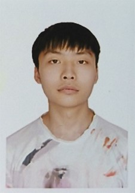

姓名 张锦洋

年    龄:    22岁

政治面貌:    群众

学    历:    本科

电    话:    18991321768

地    址:    南宁

邮    箱:    3094084480@qq\.com

__●__  教育经历

__广西民族大学__

__人工智能专业 | 本科__

__2023\.9  ~  至今__

主修课程：人工智能、机器学习、深度学习、自然语言处理、计算机视觉、数据结构与算法、数据库原理、操作系统、计算机网络等

__●__  实习经历

__字节跳动__

__数据标注师__

__2025\.9  ~  2025\.10__

参与字节跳动人工智能大模型（豆包）的监督微调（SFT）数据标注工作，负责标注处理前端交互相关数据，严格遵循标注规范，保证样本的准确性与一致性，确保模型训练数据的高质量。

__●__  项目经历

__中国机器人及人工智能大赛备赛开发__

__技术负责人__

__2025\.3  ~  2025\.8__

项目描述：围绕开鸿机器人进行动作与代码逻辑设计开发，完成机器人多模式运行的功能搭建，保障比赛中各类场景下的任务执行能力。

个人职责：

1\.	负责开鸿机器人的各项动作设计，除基础动作外，设计 “倒地起身”“奔跑” 等舵机联动复杂动作，应对比赛突发情况。

2\.	主导机器人整体代码逻辑设计，完成 “自动模式” 下的动作行为编排，以及遥控模式下 “按键” 与代码的逻辑映射。

技术栈：机器人动作设计、舵机控制、代码逻辑开发、遥控系统适配

项目成果：带领团队完成机器人开发与调试，最终斩获国家级二等奖。

__睿抗机器人开发者大赛备赛开发__

__技术负责人__

__2025\.3  ~  2025\.8__

项目描述：针对百度智能车进行视觉识别与运行逻辑优化，实现复杂场景下的道路精准识别，提升智能车的环境适应能力。

个人职责：

1\.	负责百度智能车的视觉识别模型训练，选用 PPLCNet 模型并调整训练参数。

2\.	优化训练集与测试集，完成智能车运行逻辑代码的设计与调试。

技术栈：PPLCNet 模型、视觉识别、模型调参、智能车运行逻辑开发

项目成果：带领团队实现复杂光照、特殊路面下的道路精确识别，取得省级一等奖。

__ROBOCOM 机器人开发者大赛备赛开发__

__技术负责人__

__2025\.3  ~  2025\.8__

项目描述：针对百度智能车进行视觉识别与运行逻辑优化，实现复杂场景下的道路精准识别，提升智能车的环境适应能力。

个人职责：

1\.	带领团队完成六足机器人整体设计，实现行走、翻越、低身位爬行等核心功能。

2\.	为机器人开发 “全程无线” 远程调试功能与通用型 “2\.4G 遥控” 功能，支持任意 2\.4G 设备参数修改后控制。

技术栈：足式机器人设计、无线调试开发、2\.4G 遥控系统搭建、硬件功能适配

项目成果：带领团队完成六足机器人开发，最终获得国家级三等奖。

__AGV 小车硬件开发与代码调试__

__技术负责人__

__2025\.3  ~  2025\.8__

项目描述：针对百度智能车进行视觉识别与运行逻辑优化，实现复杂场景下的道路精准识别，提升智能车的环境适应能力。

个人职责：

1\.	参与 AGV 小车硬件模块设计，完成硬件器件选型、电路搭建及硬件调试相关工作。

2\.	基于轮趣开源 ROS2 方案进行开发，编写并调试小车控制相关代码，保障代码逻辑的合理性与运行稳定性。

3\.	完成小车雷达建图与自动化巡航功能的开发与落地，实现功能的正常运行。

技术栈：AGV 小车硬件开发、ROS2、雷达建图、自动化巡航、代码调试

项目成果：成功实现 AGV 小车雷达建图与自动化巡航功能，熟练掌握 ROS2 开发流程，提升了硬件开发与代码调试的综合实操能力。

__●__  技能

__● __硬件开发：熟悉 ESP32 系列硬件架构与开发流程，熟悉树莓派裸机开发和项目部署，具备独立完成单片机选型、程序编写、调试以及实操的能力；熟悉使用 cc\-switch 将 AI 接入本地辅助开发。

__●__ 编程语言：熟悉 Python、C\+\+ 常用编程语言，能够独立完成小型课程项目，具备良好的数学与编程基础。

__●__ 开发与工具：熟悉 Linux 操作系统、Docker 容器部署、Git 代码管理；熟悉舵机 / 电机代码控制，可独立完成开发环境搭建；具备UART,SPI, I²C 通信搭建实战经验。

__●__ 数据处理：具有人工智能模型相关数据标注，以及模型训练经验。

__●__  奖项荣誉

__● __2024 年 第 7 届 “泰迪杯” 数据分析技能赛本科及以上组三等奖

__● __2024 年 睿抗机器人开发者大赛国家二等奖

__●__ 2024 年 第十四届 APMCM 亚太地区大学生数学建模竞赛参与奖

__●__ 2024 年 蓝桥杯省级三等奖

__●  __第 6 届广西大学生人工智能设计大赛三等奖

__● __第 26 届中国机器人及人工智能大赛国家三等奖

__● __2025 年 蓝桥杯省级二等奖

__● __2025 年 GPLT 程序设计天梯赛团队三等奖

__●__ 2025 年 睿抗机器人开发者大赛省级三等奖

__● __第 27 届中国机器人及人工智能大赛国家优秀奖

__● __Robocom 马术机器人越野赛国家三等奖

__● __Robocom 马术机器人障碍赛国家三等奖

__● __Robocom 马术机器人竞速赛国家三等奖

__● __2025 年 第 7 届国际青年人工智能大赛总决赛国家三等奖

__● __2025 年 中国国际大学生创新大赛 “建行杯” 广西赛区选拔赛银奖

__●__  自我评价

__● __学习能力强，对人工智能、机器人开发领域充满热情，熟练掌握 Python、C\+\+ 等编程语言，熟悉 Linux、Docker、Git 等开发工具，能快速适应各类开发岗位需求，渴望在实战中积累更多工程经验。

__● __人工智能专业在读，具备扎实的人工智能与计算机专业基础，在硬件开发、模型训练、数据标注、机器人设计等方向拥有丰富实操经验，掌握从方案设计到开发调试的完整流程。

__● __多次担任国家级、省级竞赛技术负责人，带领团队取得多项优异成绩，积累了丰富的项目管理与团队协作经验，具备良好的逻辑思维与问题解决能力，能在高压环境下保持细致和高效的工作状态，责任心强且乐于接受新挑战。

